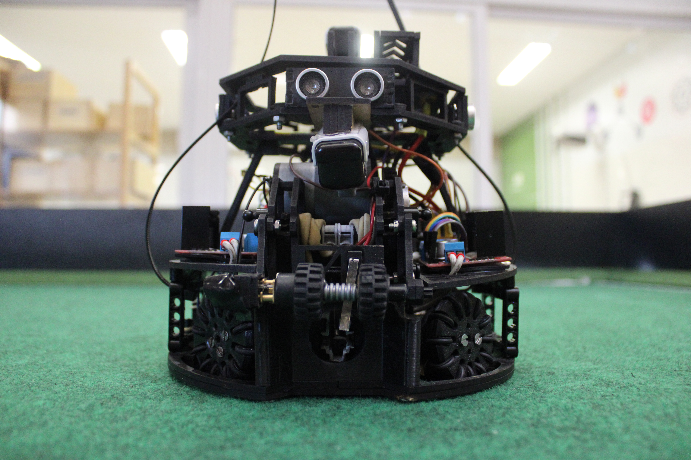

# ⚽ BIOTECH SOCCER

# ⚽ BIOTECH SOCCER

### Robótica • Programação • Estratégia • Inovação

**Construindo robôs cada vez mais rápidos, inteligentes e competitivos.**

*Equipe BIOTECH SOCCER*

---

## 🚀 Quem Somos

A **BIOTECH SOCCER** é uma equipe de Futebol de Robôs formada por estudantes apaixonados por tecnologia, engenharia e inovação.

Nosso objetivo é desenvolver robôs autônomos capazes de competir em alto nível, aplicando conhecimentos de programação, eletrônica, mecânica e inteligência estratégica.

Cada projeto representa uma oportunidade de aprender, testar novas ideias e superar desafios reais de engenharia.

---

## ⚙️ O Que Desenvolvemos

* 🤖 Robôs atacantes autônomos
* 🥅 Robôs goleiros inteligentes
* 📡 Rastreamento de bola por sensores infravermelhos
* 📏 Navegação com sensores ultrassônicos
* 🎯 Algoritmos de posicionamento
* ⚡ Estratégias de ataque e defesa em tempo real
* 🔧 Estruturas mecânicas personalizadas
* 💻 Sistemas embarcados para tomada de decisão

---

## 🛠️ Tecnologias Utilizadas

### Hardware

* Arduino
* Sensores Infravermelhos (IR)
* Sensores Ultrassônicos
* Motores DC
* Ponte H
* Baterias Li-Po
* Impressão 3D
* Eletrônica Embarcada

### Software

* C++
* Arduino IDE
* Controle de Sensores
* Algoritmos de Navegação
* Estratégias Autônomas
* Desenvolvimento Embarcado

---

## 🏆 Áreas de Atuação

### 🤖 Programação

Desenvolvimento de algoritmos para percepção, navegação e tomada de decisão dos robôs.

### ⚡ Eletrônica

Montagem e integração dos circuitos eletrônicos responsáveis pelo funcionamento do sistema.

### 🔩 Mecânica

Projeto e construção da estrutura física dos robôs utilizando modelagem e impressão 3D.

### 📊 Estratégia

Criação de comportamentos inteligentes para ataque, defesa e posicionamento durante as partidas.

---

## 📸 Nossos Robôs

### ⚽ Robô Atacante

Responsável por localizar a bola, avançar ao ataque e finalizar com precisão.

 

### 🥅 Robô Goleiro

Projetado para proteger o gol, interceptar chutes e reposicionar-se rapidamente.

---

## 📈 Atualmente Trabalhando Em

🔹 Melhorias na tomada de decisão dos robôs

🔹 Otimização dos algoritmos de ataque

🔹 Novas estratégias defensivas

🔹 Sistemas de alinhamento mais precisos

🔹 Melhor desempenho mecânico e eletrônico

🔹 Aprimoramento da velocidade de resposta

---

## 🌟 Nossa Filosofia

> A melhor forma de aprender é construir.

Acreditamos que conhecimento se transforma em experiência quando é colocado em prática.

Cada linha de código, cada componente soldado e cada partida disputada representam horas de estudo, dedicação e trabalho em equipe.

---

## 📊 GitHub Stats

---

## 📬 Contato

Caso queira acompanhar nossos projetos, trocar experiências ou conhecer mais sobre a equipe, fique à vontade para entrar em contato.

---

### ⚽🤖

## "Não construímos apenas robôs. Construímos conhecimento."

**BIOTECH SOCCER**

